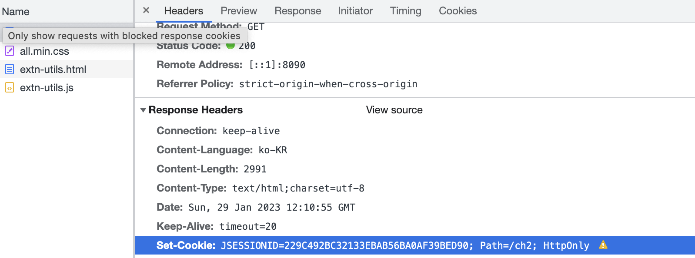
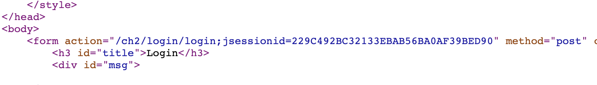

# session이란?

- 쿠키를 허용하지 않을 때

_response header_

: 쿠키를 요청으로 계속 보내지만 응답에는 쿠키가 생기지 않는다.
그래서 모든 쿠키를 허용하지 않는 사이트에는 url에 jsessionid를 추가하여 전송해야 한다. 이렇게 하면 요청에 응한 url에 응답 할 수 있다. 

_view source_

: 이것은 자동으로 쿠키가 추가된 모습이다. `<c: url>` 태그를 써야 쿠키를 허용하지 않는 session에도 쿠키를 전송 할 수 있다.

# session의 생성과정

# session 객체 얻기

# session의 method

# session의 종료 

# session vs cookie
